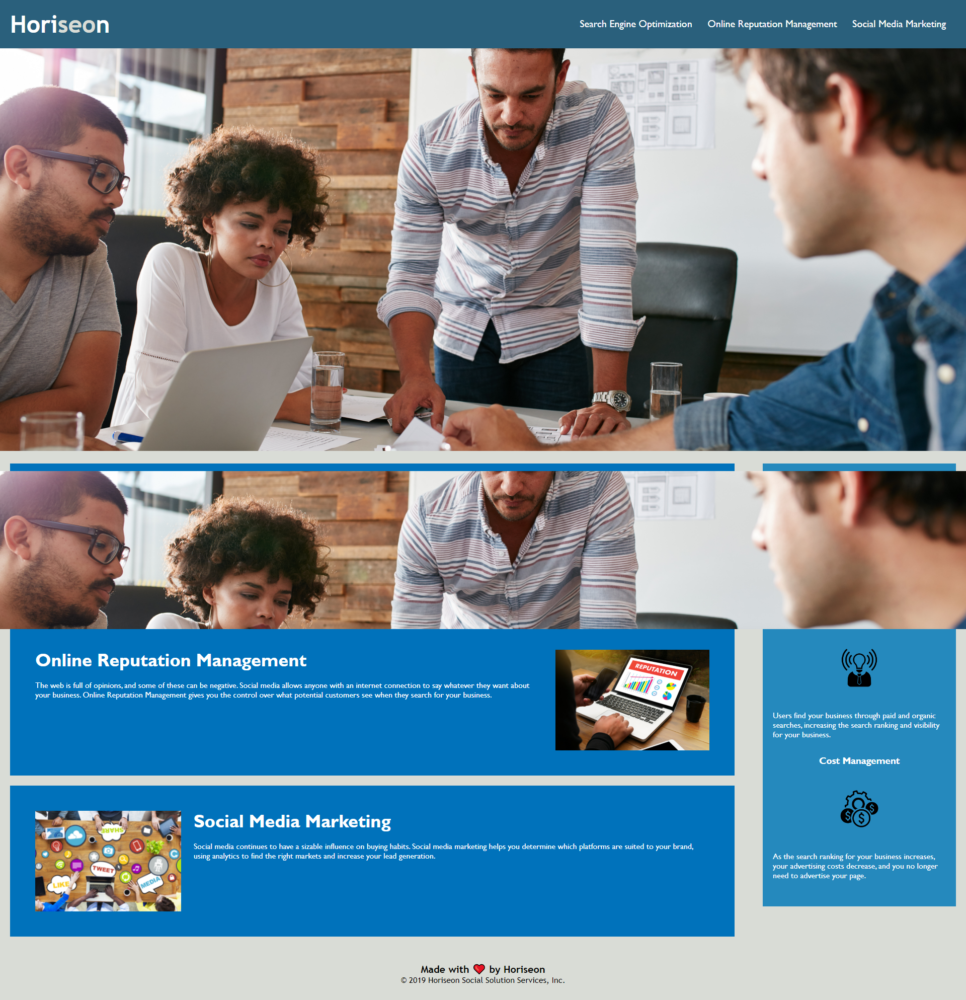

# Horiseon-Accessability

## Purpose
A website that offers SEO training services.

## Description
Provide a short description explaining the what, why, and how of your project. Use the following questions as a guide:
- What was your motivation?
- Why did you build this project? (Note: the answer is not "Because it was a homework assignment.")
- What problem does it solve?
- What did you learn?

## Built with
* HTML
* CSS

## Website
https://zaclark369.github.io/Horiseon-Accessability/

## Usage
   ```md
   
   ```

## Contribution
Made with ❤️ by Zac Clark
* https://github.com/zaclark369

### ©️2021 Horiseon, Inc
